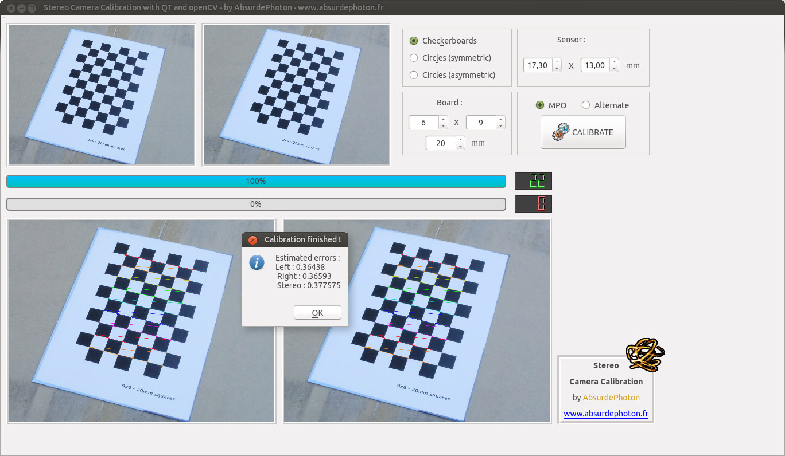

# calib-mpo

## 3D stereo camera calibration with QT and openCV, using stereo pairs (PNG, TIF, JPG) or stereo MPO images

### v1 2018-07-10

## LICENSE

The present code is under GPL v3 license, that means you can do almost whatever you want
with it!
I used bits of code from several sources, mainly from the openCV examples
 
 

## WHY?

I didn't find any simple tool (understand: GUI) to calibrate my lens for stereo photography, because my camera produces MPO files. So why not writing it myself ?
I'm not an ace of C++ and QT, in fact I only started using them some month ago. So, if you don't find my code pretty never mind, because it WORKS, and that's all I'm asking of it :)
 
 

## WITH WHAT?

Developed using:
* Linux: Ubuntu	16.04
* QT Creator 3.5.1
* QT 5.5.1
* openCV 3.4.1

This software should also work under Microsoft Windows: if you tried it successfully please contact me.
 
 

## HOW?

You must first take pictures of checkerboards or circle grids, explained here : https://docs.opencv.org/3.4.1/d4/d94/tutorial_camera_calibration.html

### How to use the software:
* Select the type of board (openCV-type) you photographed: checkerboard, symmetric or asymmetric circles
  * Checkerboard:
    * enter the number of inner corners: H x V where H  is the number of columns and V the number of rows
    * enter the size (in millimeters) of the side length of the squares
  * Symmetric circles:
    * enter the number of circles: H x V where H  is the number of circles per columns and V the number of rows
    * enter the size (in millimeters) of the circles diameter
  * Asymmetric circles:
    * enter the number of circles: H x V where H  is the number of circles per columns (it is the same one every row, even if they are shifted) and V the number of rows
    * enter the size (in millimeters) of the circles diameter
* Enter your camera’s sensor size (in millimeters)
* Select whether your images are in MPO format or not. openCV accepts many image types like JGP, PNG, TIF…
  * Your MPO images must contain two jpegs, forming a stereo pair
  * If not using MPO:
    * provide 2 files for each stereo pair
    * the pair is composed of 2 separate images: first file = LEFT, second file = RIGHT
    * of course the total number of files must be EVEN
* Click on the CALIBRATE button:
  * Select several image files (with  &lt;SHIFT&gt; and &lt;CTRL&gt;)
  * The stereo pairs are displayed and processed. If the patterns (checkerboard or circles) are found, they are drawn over the original image
  * There are indicators during this first part: 
    * the blue progress bar represents the overall progress
    * the red one shows the images that didn’t match the pattern (the red LED indicator also shows that information)
    * the green LED indicator shows the successful patterns found in stereo pairs
  * When the overall progress bar reaches 100%, be patient: your camera lens parameters are being computed – it can take a long time, depending on your computer CPUs and the number of successful image pairs (for good results, at least 30 for checkerboards and 15 for circles)
  * When the parameters are found:
    * a message shows the average errors found for the images, for the left and right lens, AND the stereo pairs
    * you will be asked a folder location where you will save the lens parameters, in openCV format (XML and YAML). 3 files will be created: calibration-left, calibration-right and calibration-stereo.xml

The resulting XML files produced by the software will be useful when you want to rectify stereo pairs before computing a depthmap, or find extrinsic values from them. My disparity and depth map filtering utility is avalable here : https://github.com/AbsurdePhoton/disparity-filtering-mpo
 
 

## Enjoy!

### AbsurdePhoton
My photographer website ''Photongénique'': www.absurdephoton.fr
